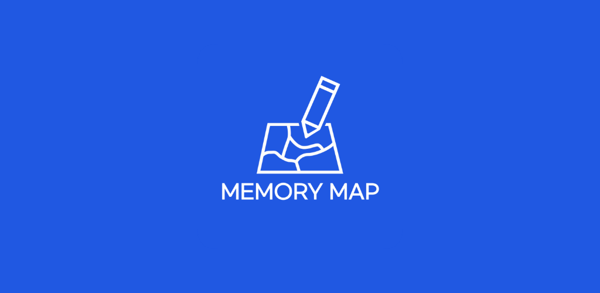
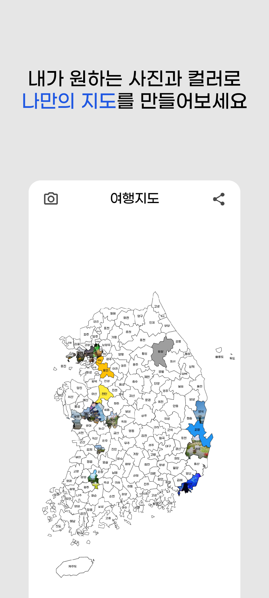
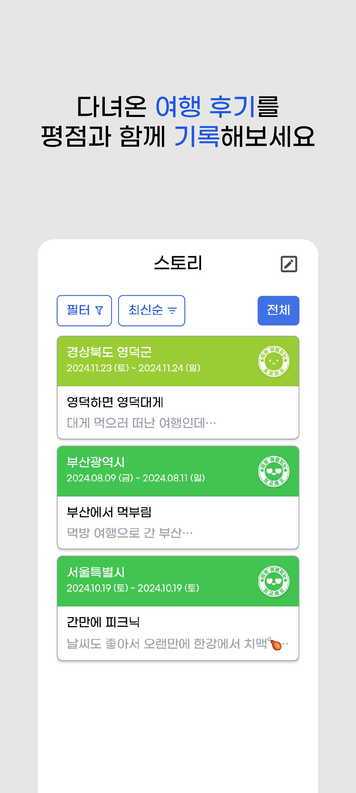
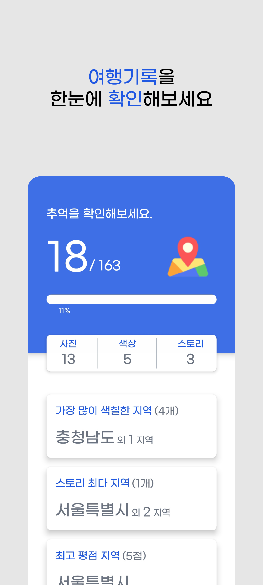
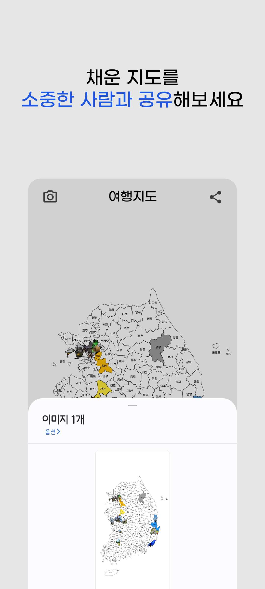

# 📍 메모리맵 (MemoryMap)

> 특별한 나만의 지도! 내가 여행한 지역을 사진과 컬러로 꾸며 세상에 하나뿐인 지도를 만들어보세요.



---

## 📦 프로젝트 정보

- **프로젝트 주소**

  - [MemoryMap - Google Play Store](https://play.google.com/store/apps/details?id=com.memorymap&pli=1)

- **프로젝트 기간**

  - 서비스 개발: 2024.10 ~ 2025.02
  - 유지보수 및 개선: 2025.07 ~ 진행 중

- **개발 인원**

  - 1인 개발

---

## 🧭 프로젝트 소개

### 1. 나만의 지도 만들기

여행한 지역을 사진 또는 원하는 컬러로 꾸며 나만의 지도를 만들 수 있어요.

### 2. 여행 기록 스토리

간단한 후기와 점수를 통해 여행 기록을 남기고, 같은 지역에 여러 번 등록도 가능합니다.

### 3. 여행 정보 요약

대시보드에서 내가 다녀온 여행 정보를 요약해서 확인할 수 있습니다.

### 4. 지도 캡처 및 공유

캡처하거나 친구, 연인과 공유할 수 있어요. 나만의 여행 지도를 자랑해보세요.

---

## 🛠 기술 스택

### Frontend

<p align="left">
  
  
</p>

### Backend

<p align="left">
  
  
</p>

### State Management

<p align="left">
  
  
</p>

### Local Database

<p align="left">
  
</p>

### Local Storage

<p align="left">
  
  
</p>

### API

<p align="left">
  
  
</p>

### Design

<p align="left">
  
  
</p>

### Build Tools

<p align="left">
  
  
</p>

### Code Quality

<p align="left">
  
  
</p>

---

## 📁 프로젝트 폴더 구조

> 파일은 생략

```
├── README.md
├── App.tsx
├── navigation.tsx
├── package.json
├── tailwind.config.js
├── tsconfig.json
├── app.json
├── .eslintrc.js
├── .prettierrc.js
├── babel.config.js
├── metro.config.js
├── nativewind-env.d.ts
├── .env
├── assets
│ ├── bootsplash
│ ├── fonts
│ └── images
└── src
│ ├── components
│ │ ├── alert
│ │ ├── common
│ │ ├── map
│ │ ├── modal
│ │ ├── view
├── constants
├── database
├── hook
├── recoil
├── screens
├── style
├── types
└── utils
```

---

## 🖥️ 주요 화면 구성 (플레이스토어 기준)

<p align="center">
  
  &nbsp;
  
  &nbsp;
  
  &nbsp;
  
</p>

---

## 🎯 주요 화면 및 기능 요약

### [기본 세팅]

- AdMob (`react-native-google-mobile-ads`)을 통해 앱 실행 시 광고 노출
- 지도 색칠 및 스토리 작성 각 2회마다 광고 실행
- 네트워크 연결 상태 확인 후 화면 전환
  - 연결됨: 기존 페이지 진입
  - 연결 안 됨: `NoNetwork` 화면으로 전환

---

### [초기 화면]

- 앱 실행 시 splash 화면 표시
- SQLite local database 연결 및 테이블 확인/생성
- 앱 버전 확인 후 업데이트 유도 Dialog 노출 (Google Play Store 비교)
- 핀코드(keychain 저장 여부)에 따라:
  - 설정됨: 잠금화면 진입
  - 미설정: 지도 메인화면 진입

---

### [지도(메인) 화면]

- Lazy Loading을 활용한 맵 화면 로딩
- `react-native-svg`를 활용한 지도 SVG 렌더링
- 지역 클릭 시 BottomSheet를 통해 사진/색칠 선택
- 사진 선택: `react-native-image-crop-picker` → 자르기 → `react-native-image-resizer`로 최적화 후 저장
- 색칠하기: 팔레트를 통해 색상 선택 및 저장
- 지도 캡처: `react-native-view-shot` → 저장: `@react-native-camera-roll/camera-roll`
- 지도 공유: `react-native-share`
- 사진이 포함된 지역은 돋보기 버튼으로 확대 보기 가능

---

### [스토리 화면]

- 정렬(최신순/날짜순) 가능한 카드 리스트 구성
- 지역 필터링 기능 지원
- `useInfiniteQuery`로 무한 스크롤 구성 (10개 단위 로드)
- 카드 내에 지역, 여행일자, 제목, 평점 간단 표시

---

### [스토리 내용 화면]

- 카드 클릭 시 스토리 상세 진입
- 작성 내용 전체 보기
- 하단 버튼들:
  - 수정 (아이콘)
  - 저장 (지도와 동일한 캡처 저장 방식)
  - 공유 (지도와 동일한 방식)
  - 삭제

---

### [스토리 작성 화면]

- 색칠된 지역만 선택 가능
- 지역 리스트는 `FlatList`로 렌더링 + `react-native-reanimated`로 accordion 애니메이션
- 여행 일자 선택 시 캘린더 포함 Bottom Sheet 팝업
- 지역, 일자, 제목, 내용, 평점 모두 입력 시 저장 버튼 활성화

---

### [대시보드 화면]

- 색칠된 지역, 스토리 데이터 한눈에 확인 가능
- 색칠 비율은 막대형 Progress Bar로 시각화
- 사진/색상 수, 스토리 수 표시

---

### [설정 화면]

- 지역명 표시 여부 설정
  - 항상 표시 / 빈 지역만 / 표시 안 함
  - 선택값은 `Async Storage`에 저장 + `Recoil` 상태 동기화
- 암호잠금 기능
  - `Keychain`에 핀코드 저장 여부 확인 후 `Recoil`로 상태 관리
- 지도 초기화 기능 (스토리는 유지됨)
- 의견 보내기 (이메일 `Linking`)
- 리뷰 작성 (Play Store `Linking`)
- 서비스 이용약관 및 개인정보 처리방침 연결
- 앱 버전 정보 (`react-native-device-info`)
- 구글 드라이브 백업
  - Firebase Auth 로그인
  - `react-native-cloud-storage`로 암호화 후 저장 (`react-native-crypto-js`)
  - **심사 이슈로 현재는 프로덕션에서는 비활성화**

---

## [그 외 기능]

- `@react-navigation/bottom-tabs`로 화면 전환 구조 관리
- 하드웨어 뒤로가기 버튼:
  - `BackHandler` 사용하여 페이지별 커스텀 처리
  - 메인 화면 탭(지도/스토리/대시보드/설정)에서는 두 번 클릭 시 앱 종료
- `react-native-toast-message`로 사용자 이벤트 알림 처리
- `dayjs`를 통한 날짜 포맷 처리

---

## 🚧 개선 목표

- 전체적인 코드 최적화
- Lazy Loading 적용에도 SVG 지도의 렌더링 성능 개선 필요
- 상태관리 라이브러리를 Recoil → Zustand로 전환 고려
- 모바일뿐 아니라 태블릿 화면 비율까지 고려한 반응형 스타일 개선
- 백업 방식 : Google Drive → Firebase Cloud Firestore로의 전환 고려
